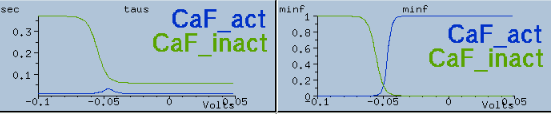
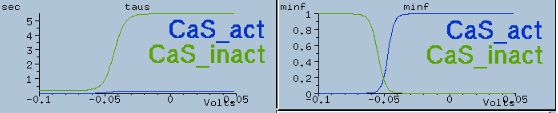
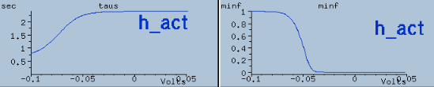
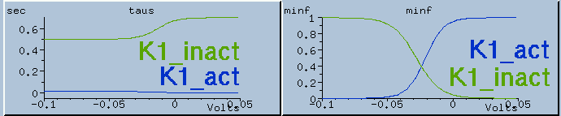
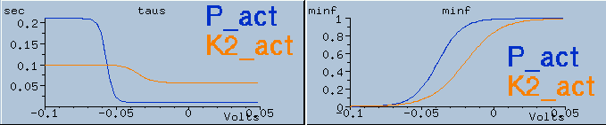
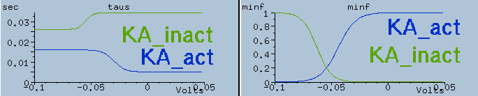
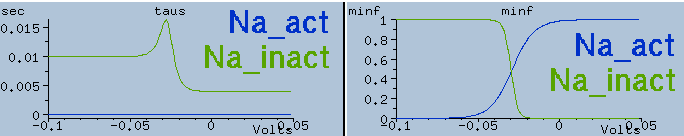
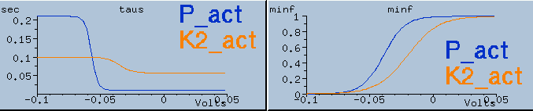

# Ionic Currents Comparison with Genesis 

## CaF: fast, low-threshold Ca2+ Current

_of_activation_variables_of_ca_fast_channel.png) 
*Steady State*

_of_activation_variables_of_ca_fast_channel.png)
*Time Course*

*Genesis*

## CaS: Slow, Low-threshold Ca2+ Current

_of_activation_variables_of_ca_slow_channel.png) 
*Steady State*

_of_activation_variables_of_ca_slow_channel.png)
*Time Course*

*Genesis*

## H: Hyperpolarization-activated Cation Current 

_of_activation_variables_of_h_channel.png) 
*Steady State*

_of_activation_variables_of_h_channel.png)
*Time Course*

*Genesis*

## KF: FMRFamide (Phe-Met-Arg-Phe-NH2) activated K+ current

_of_activation_variables_of_k_fast.png) 
*Steady State*

_of_activation_variables_of_k_fast.png)
*Time Course*

## K1: Delayed-rectifier K+ Current

_of_activation_variables_of_k1.png) 
*Steady State*

_of_activation_variables_of_k1.png)
*Time Course*

*Genesis*

## K2: Persistent K+ Current

_of_activation_variables_of_k2.png) 
*Steady State*

_of_activation_variables_of_k2.png)
*Time Course*

*Genesis*

## KA: Fast, Transient K+ Current

_of_activation_variables_of_ka.png) 
*Steady State*

_of_activation_variables_of_ka.png)
*Time Course*

*Genesis*

## Na: Fast Na+ Current

_of_activation_variables_of_na.png) 
*Steady State*

_of_activation_variables_of_na.png)
*Time Course*

*Genesis*

## P: Persistent Na+ Current

_of_activation_variables_of_p.png) 
*Steady State*

_of_activation_variables_of_p.png)
*Time Course*

*Genesis*
